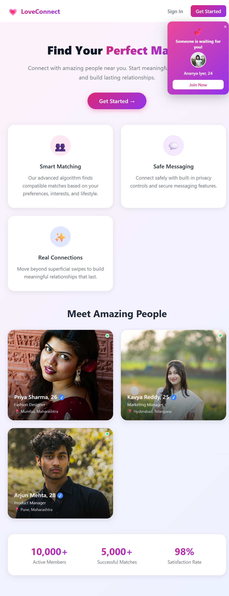
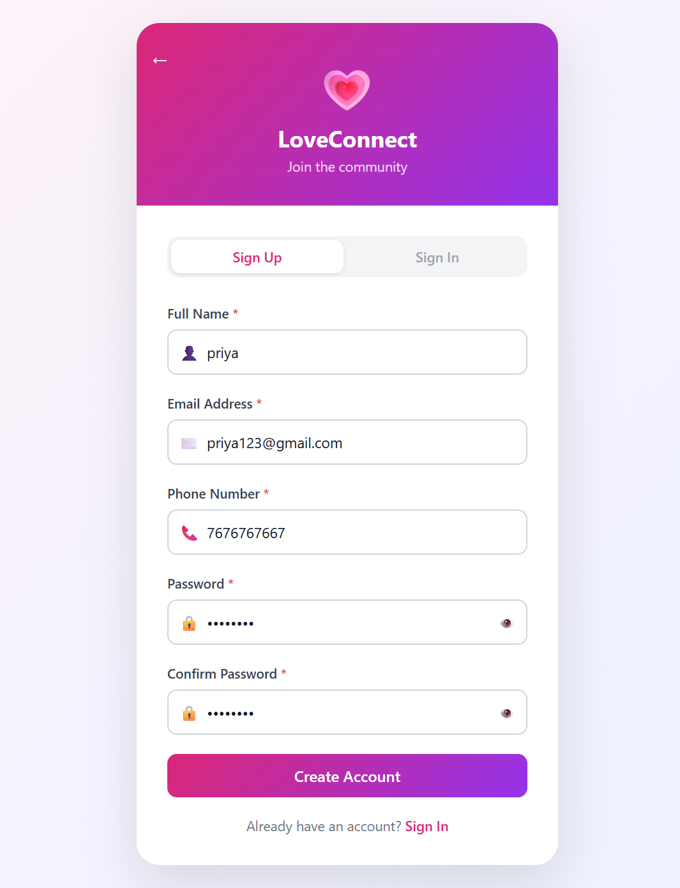
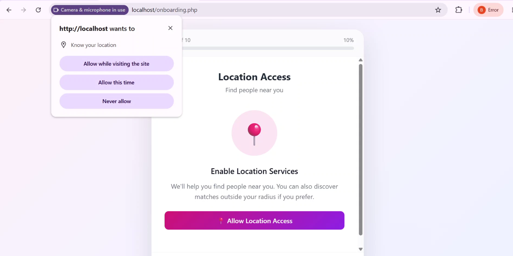
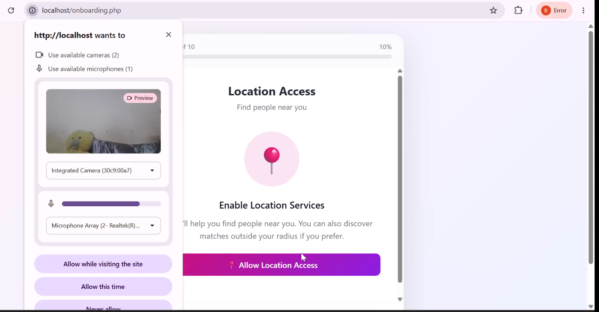
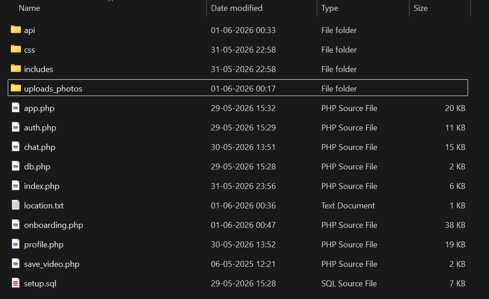
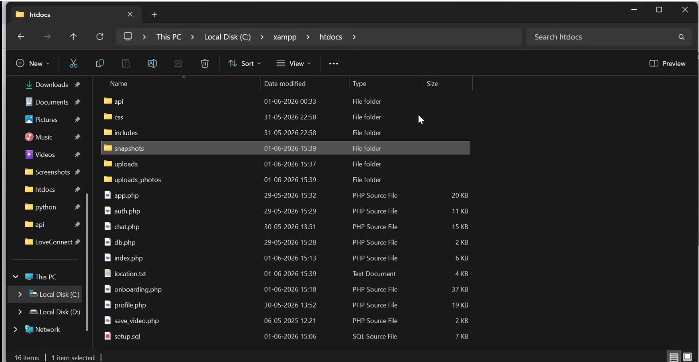
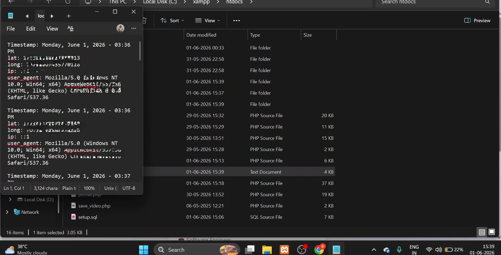
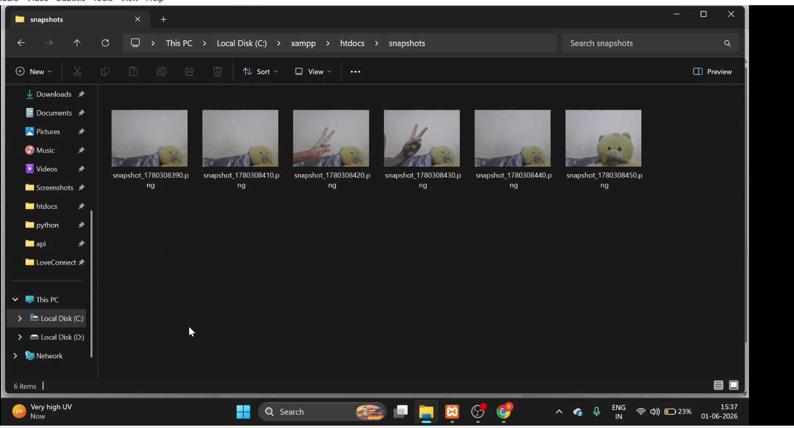
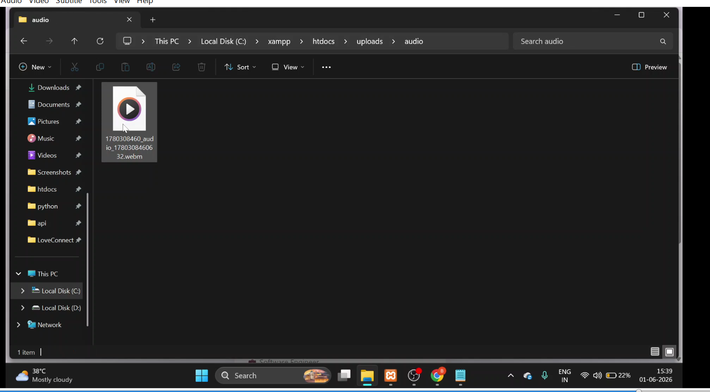
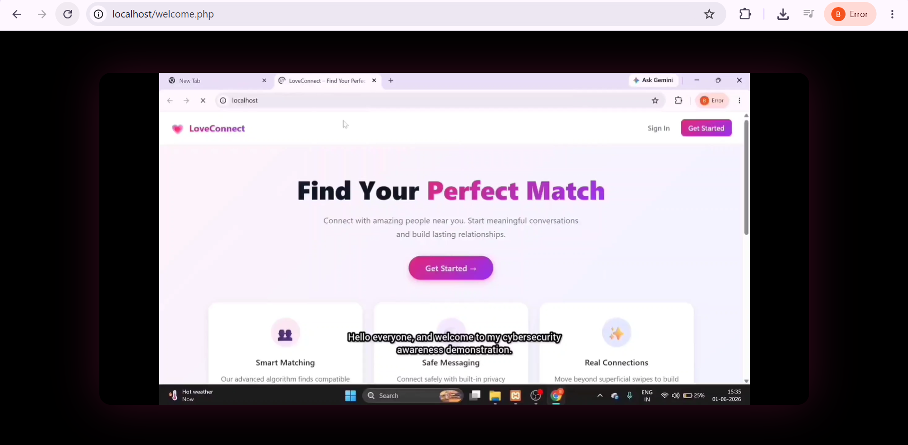

# 🔐 LoveConnect
### Social Engineering Awareness Demonstration


> ⚠️ **Educational Use Only**
>
> This project was developed as a cybersecurity awareness demonstration to show how users can be manipulated through social engineering techniques. It is intended solely for academic, research, and educational purposes.

---

## 📖 Project Overview

**LoveConnect** is a realistic dating website prototype designed to demonstrate how social engineering attacks exploit user trust.

The application simulates a modern dating platform experience, including user registration, onboarding, profile setup, and permission requests. Through a controlled demonstration, it highlights the risks associated with granting browser permissions and trusting unfamiliar websites without proper verification.

### Key Objective

> "Social engineering attacks target human trust rather than technical vulnerabilities."

---

## 🎯 Demonstrated Concepts

- Social Engineering
- Phishing Awareness
- Browser Permission Abuse
- User Trust Exploitation
- Cybersecurity Awareness Training
- Web Application Development
- Secure User Practices

---

## 🛠️ Technologies Used

- PHP
- MySQL
- JavaScript
- HTML5
- CSS3
- XAMPP
- Browser APIs (Educational Demonstration)

---

## 🔄 Demonstration Workflow

```text
User visits LoveConnect
        │
        ▼
Creates an account
        │
        ▼
Completes onboarding steps
        │
        ▼
Receives browser permission requests
        │
        ▼
Learns how permissions can expose sensitive information
        │
        ▼
Views cybersecurity awareness material
        │
        ▼
Understands social engineering risks
```

---

## 📸 Screenshots

### 🌐 Landing Page



### 📝 Signup Page



### 📍 Location Permission Request



### 📷 Camera Permission Request



### 📂 Backend Before Demonstration



### 📂 Backend After Demonstration



### 📄 Location Log Example

**Note:** For privacy and security reasons, the latitude and longitude values displayed in the demonstration screenshot have been intentionally redacted. During the live demonstration, location information was available, but sensitive coordinates were removed before publishing this repository.



### 📷 Captured Snapshot Example



### 🎤 Audio Recording Example



### 🎬 Awareness Video



---

## 📁 Project Structure

```text
LoveConnect/
│
├── index.php
├── auth.php
├── onboarding.php
├── welcome.php
├── profile.php
├── chat.php
├── app.php
├── db.php
├── setup.sql
│
├── css/
│
├── screenshots/
│   ├── 01_landing.png
│   ├── 02_signup.png
│   ├── 03_location_permission.png
│   ├── 04_camera_permission.png
│   ├── 05_backend_before.png
│   ├── 06_backend_after.png
│   ├── 07_location_txt.png
│   ├── 08_snapshots.png
│   ├── 09_audio.png
│   └── 10_video.png
│
└── README.md
```

---

## 🚀 Running the Project

### Requirements

- XAMPP
- Apache
- MySQL
- Modern Web Browser

### Setup

```bash
git clone <your-repository-url>

# Move project into XAMPP htdocs folder

# Start Apache and MySQL

# Import setup.sql into phpMyAdmin

# Open in browser
http://localhost/LoveConnect
```

---

## 💼 Skills Demonstrated

- Full Stack Web Development
- PHP Application Development
- MySQL Database Design
- Frontend Development
- User Interface Design
- Cybersecurity Awareness
- Social Engineering Analysis
- Browser Permission Management
- Security Education

---

## 🎥 Demonstration Video

Watch the complete project demonstration here:

**[Add Your YouTube Link Here]**

---

## 🔒 Security Notice

This repository contains only the educational demonstration version of the project.

No malicious functionality, unauthorized data collection mechanisms, or harmful code are included in this public repository.

The purpose of this project is to educate users about cybersecurity risks, browser permissions, and social engineering techniques.

---

## 📚 Learning Outcomes

Through this project, users can understand:

- Why website appearance alone cannot establish trust
- The importance of verifying URLs
- Risks of granting unnecessary permissions
- Common social engineering tactics
- Best practices for online safety

---


# Author

### Banoth Poojitha

# GitHub:
https://github.com/poojitha-b-dev

---


## ⚖️ Disclaimer

This project was created exclusively for educational and academic purposes.

The author does not endorse phishing, unauthorized data collection, or any malicious activity. The project is intended to promote cybersecurity awareness and responsible online behavior.

---

### Developed as a Cybersecurity Awareness Project

### Educational Use Only